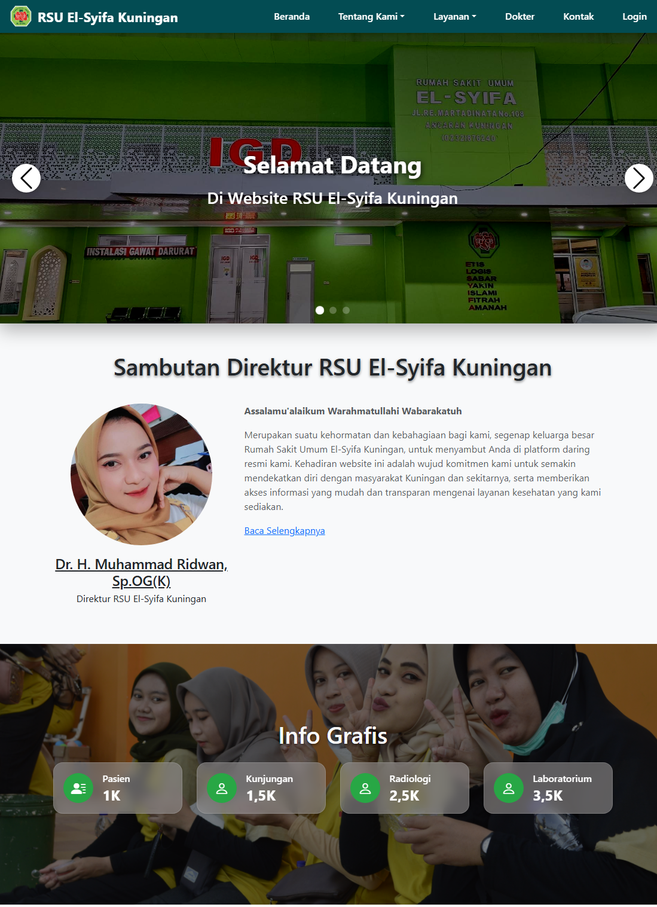

# Website Official Jatman Jabar
## Deskripsi
Website ini dilengkapi dengan berbagai fitur modern berbasis web untuk menampilkan infrmasi yang menarik dan mudah di akses. 
Menggunakan bootstrap 5 dengan kustomisasi pada CSS agar tampilan lebih baik. 
Website ini dilengkapi dengan admin panel yang responsif dan dinamis, sehingga mempermudah pemilik/pengelola website melakukan kustomisasi pada tampilannya.




## Fitur Dan Halaman
- **Hero Section** dengan slider informasi penting dan background image yang bisa diubah sesuai keinginan
- **Navbar Menu** Menu navigasi, terletak pada bagian atas halaman. Berfungsi mempermudah pengunjung web menuju halaman yang diinginkan.
- **Dafatar Artikel / Berita** Menampilkan daftar artikel/berita terbaru.
- **Form Pencarian** Berguna untuk mempermudah pengunjung web mencari artikel/berita berdasarkan kata kunci.
- **Daftar Tag/Kategori** Menampilkan daftar kategori artikel/berita.
- **Footer** Menampilkan menu footer dan copyright.
## Teknologi
### Backend
- PHP 8.2
- MySQL 9.1.0
### Frontend
- Bootstrap 5.3
- Swiper JS 10.0
- GoJs 3.0
- jQuery 3.7
## Lisensi
- Apache License Version 2.0
- Copyright (c) 2025 Jatman Jabar
## Struktur Directory
```bash
 my-app/
├─ node_modules/
├─ public/
│  ├─ favicon.ico
│  ├─ index.html
│  ├─ robots.txt
├─ src/
│  ├─ index.css
│  ├─ index.js
├─ .gitignore
├─ package.json
├─ README.md
```

